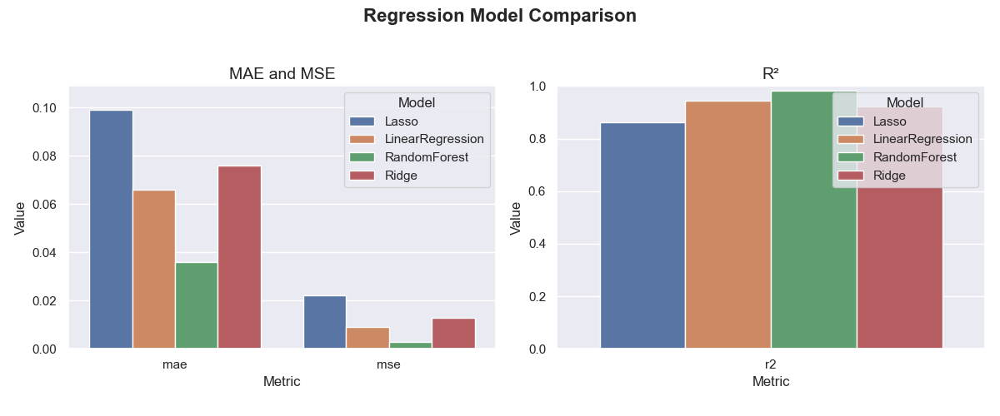

# Contents/Оглавление

* [EN](#en)
* [RU](#ru)

# *EN*

# 🏡 House Prices — Advanced Regression Techniques

Predicting the sale price of a house based on various features using multiple regression models.

## Project Goal

Build regression models to predict `SalePrice` of houses using data from the [Kaggle: House Prices - Advanced Regression Techniques](https://www.kaggle.com/competitions/house-prices-advanced-regression-techniques) competition.

## Work stages

### 1. EDA (Data Analysis)
- Gaps and distribution features identified
- Target variable transformed: logarithmic transformation `log1p(SalePrice)`
- Distribution, dependency and correlation graphs constructed

### 2. Feature Engineering
- Feature `LogSalePrice` created
- Gaps filling: median (numeric), mode (categorical)
- Scaling of numeric features
- One-Hot Encoding of categorical

### 3. Model training
Models were used with pipelines:
- Linear Regression
- Ridge Regression
- Lasso Regression
- Random Forest Regressor

### 4. Metrics and comparison
Metrics (MAE, MSE, R²) and ROC/Confusion Matrix comparison graphs for models are presented in the `plots` folder.

### 5. Summary
Random Forest showed the best performance:
- MAE: 0.039
- MSE: 0.004
- R²: 0.978

## Project structure

├── data/ # train.csv and test.csv data

├── src/

│ ├── preprocess.py # Data preprocessing

│ ├── train_lasso.py # Lasso training

│ ├── train_rf.py # RandomForest

│ └── ...

├── models/ # Saved models and metrics

├── plots/ # Model comparison plots

├── notebooks/EDA.ipynb, plots.ipynb

├── submissions/ # CSV files for Kaggle

├── README.md # This file

## Skills and technologies

- Pandas, NumPy, Matplotlib, Seaborn
- Scikit-learn (Pipeline, ColumnTransformer, models, metrics)
- Feature Engineering
- Working with Git/GitHub
- Machine learning principles (regression, log transforms)
- Model evaluation

## Links

- [Kaggle project](https://www.kaggle.com/code/yaninakostiv/eda-house-prices)
- [GitHub repository](https://github.com/SuperYanka/house-prices-regression)
- [Profile in LinkedIn](https://www.linkedin.com/in/superyanka/)

---

# *RU*

# 🏡 House Prices — Advanced Regression Techniques

Предсказание цены продажи дома на основе различных признаков с помощью нескольких регрессионных моделей.

## Цель проекта

Построить модели регрессии для прогнозирования `SalePrice` домов, используя данные с соревнования [Kaggle: House Prices - Advanced Regression Techniques](https://www.kaggle.com/competitions/house-prices-advanced-regression-techniques).

## Этапы работы

### 1. EDA (Анализ данных)
- Выявлены пропуски и особенности распределения
- Преобразована целевая переменная: логарифмическое преобразование `log1p(SalePrice)`
- Построены графики распределений, зависимостей и корреляций

### 2. Feature Engineering
- Создан признак `LogSalePrice`
- Заполнение пропусков: медиана (числовые), мода (категориальные)
- Масштабирование числовых признаков
- One-Hot Encoding категориальных

### 3. Обучение моделей
Модели использовались с пайплайнами:
- Linear Regression
- Ridge Regression
- Lasso Regression
- Random Forest Regressor

### 4. Метрики и сравнение
Метрики (MAE, MSE, R²) и графики сравнения ROC/Confusion Matrix для моделей представлены в папке `plots`.

### 5. Итог
Лучшую производительность показал Random Forest:
- MAE: 0.039
- MSE: 0.004
- R²: 0.978

## Структура проекта

├── data/ # Данные train.csv и test.csv

├── src/

│ ├── preprocess.py # Предобработка данных

│ ├── train_lasso.py # Обучение Lasso

│ ├── train_rf.py # RandomForest

│ └── ...

├── models/ # Сохранённые модели и метрики

├── plots/ # Графики сравнения моделей

├── notebooks/EDA.ipynb, plots.ipynb

├── submissions/ # CSV-файлы для Kaggle

├── README.md # Этот файл

## Навыки и технологии

- Pandas, NumPy, Matplotlib, Seaborn
- Scikit-learn (Pipeline, ColumnTransformer, модели, метрики)
- Feature Engineering
- Работа с Git/GitHub
- Принципы машинного обучения (регрессия, лог-преобразования)
- Оценка моделей

## Ссылки

- [Проект на Kaggle](https://www.kaggle.com/code/yaninakostiv/eda-house-prices)
- [Репозиторий на GitHub](https://github.com/SuperYanka/house-prices-regression)
- [Профиль в LinkedIn](https://www.linkedin.com/in/superyanka/)

---

